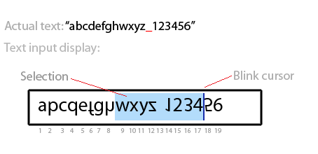

Custom text input based on the HTML canvas 

# Concept
Using the GWT (Google Web Toolkit) implement a non-native custom web text input control. The control flips vertically all the letter at even positions while keeping the letters at the odd positions intact.  
The concept of the control is presented on the below sketch: 

The control supports any UTF-8 encoded text input, updating its displayed contents real-time (as the user types it). 
Every letter at an even position is shown turned upside down. 
The baselines of the inverted font must be adjusted not to break the text vertical alignment of the letters in the resulting text view which contains letters with mixed orientations (as shown on the picture). 
The control must display a regular text cursor indicating the current position. This cursor must be blinking roughly once a second (like in a normal text input). 

# Implementation
The control must be implemented with the pure GWT, <b>without using any third-party libraries (neither Java, nor Javascript based)</b>. The implementation must be based on the HTML canvas and must work fine at least with the latest versions of the modern browsers. 
The style of the control and its text (font, color) preferably shall be taken from the accompanying CSS. 
You must create a small GWT demo/test application containing your text input control. 
The maximum input length must be set to 310 characters and there must visibly fit approximately 25-40 characters within the control bounds. 

# Operations and behavior
The control works as a single line text input field. It must feel almost like a regular text input and support the following features: 
<ul>
<li>Text selection with keyboard and mouse.</li>
<li>Clipboard operations: copy, cut, paste, select all. These operations shall be accessible from a popup menu and standard keyboard shortcuts</li>
<li>Single word selection with a double click</li>
<li>Cursor navigation with keyboard and mouse</li>
<li>If the text doesn't fit its horizontal bounds, the control must draw the text up to the last fully visible letter and let the user move back and forth to the parts of the text which don't fit, using a cursor. </li>
<li>If the text doesn't fit its vertical bounds it must cut at the bottom.</li>
<li>An attempt to select a text beyond the control bounds shall cause the input to scroll (left or right) to show the current cursor position as it moves (left or right) along the course of the selection.</li>
</ul>

# Notes
<ul>
<li>The space character counts for a valid letter thus it is included in the enumeration of odd/even positions.</li>
</ul>

# Questions
If anything stays undefined or unclear from this assignment, then instead of asking, you shall just implement it in any preferred way and provide a note of what was unclear and what were the assumptions which you had for that
